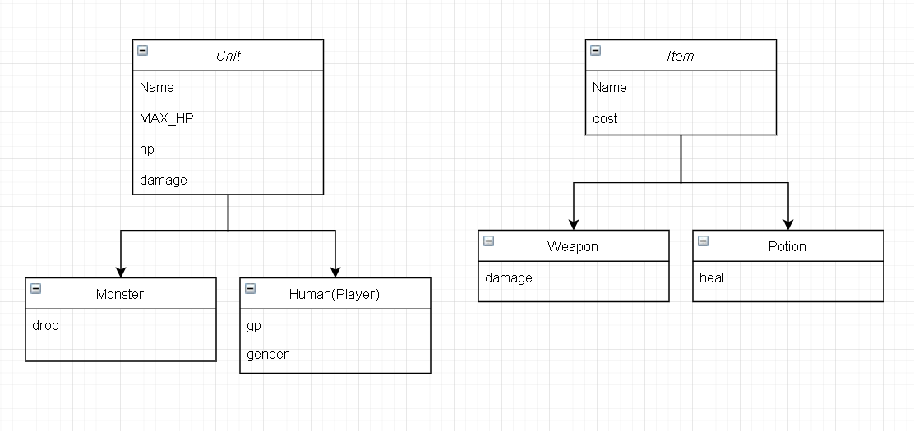

# Console based JAVA RPG
Project summary: Mini rpg game runned by Java virtual machine. Ability to take battles, earn coins, buy and sell from shops. Inventory features.

# Tech Stack
- Environment: JDK 1.8
- IDE: IntelliJ
- Language: Java

# Entity structure table

# Flow diagram

# Improvements
- Adding experience points
- I/O file load/save
- Increase monster unit
- Weapon change percentage stat
- Story Mode
- Boss monsters
- adding GUI interfaces

